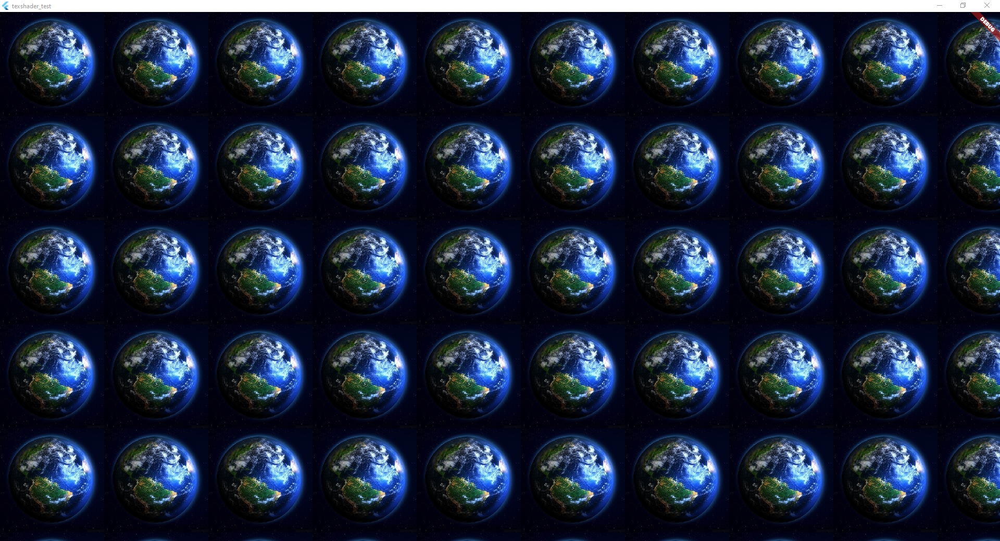

# texshader_test

Testing textures with Flutter shaders.



### shader

```glsl
#version 320 es

precision highp float;

layout (location = 0) out vec4 fragColor;
layout (location = 0) uniform sampler2D tex;

void main() {
  vec2 coords = 0.005*(gl_FragCoord.xy);
  vec4 texColor=texture(tex,coords);
  fragColor = texColor;
}
```

### create texture

```dart
ui.Image? img; // ui.Image that holds the pixels read from file

rootBundle.load("assets/images/erdkugel.jpg").then((value) {
    ui.decodeImageFromList(value.buffer.asUint8List(), (result) {
        img = result;
    });
});

// create sampler uniforms with ImageShader
final ImageShader imgS = ImageShader(
    img,
    // how the image will be repeated in x and y direction
    ui.TileMode.repeated,
    ui.TileMode.repeated,
    // identity matrix for no transformation
    Float64List.fromList(
        [
            1, 0, 0, 0, //
            0, 1, 0, 0, //
            0, 0, 1, 0, //
            0, 0, 0, 1, //
        ],
    ),
);

// provide sampler as uniform at loc 0
final shader = shaderProgram.shader(
    floatUniforms: Float32List.fromList([]),
    samplerUniforms: [imgS],
);
```

## Fully working Windows example 

[main.dart](lib/main.dart)

## Getting Started

This project is a starting point for a Flutter application.

A few resources to get you started if this is your first Flutter project:

- [Lab: Write your first Flutter app](https://docs.flutter.dev/get-started/codelab)
- [Cookbook: Useful Flutter samples](https://docs.flutter.dev/cookbook)

For help getting started with Flutter development, view the
[online documentation](https://docs.flutter.dev/), which offers tutorials,
samples, guidance on mobile development, and a full API reference.
